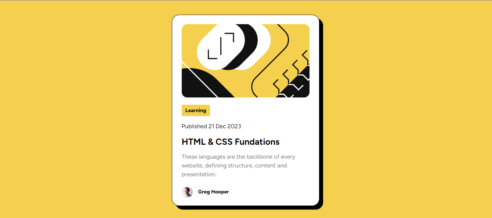

# Frontend Mentor - Blog preview card solution

This is a solution to the [Blog preview card challenge on Frontend Mentor](https://www.frontendmentor.io/challenges/blog-preview-card-ckPaj01IcS). Frontend Mentor challenges help you improve your coding skills by building realistic projects. 

## Table of contents

- [Overview](#overview)
  - [The challenge](#the-challenge)
  - [Screenshot](#screenshot)
  - [Links](#links)
- [My process](#my-process)
  - [Built with](#built-with)
  - [What I learned](#what-i-learned)
  - [Continued development](#continued-development)
  - [Useful resources](#useful-resources)
- [Author](#author)

## Overview
Frontend Challengue card

### The challenge

Users should be able to:

- See hover and focus states for all interactive elements on the page

### Screenshot

### Links

- Solution URL: [Add solution URL here](https://your-solution-url.com)
- Live Site URL: [Add live site URL here](https://your-live-site-url.com)

## My process
It took me a little work to fix the image on the card but everything else was easy for me.

### Built with

- Semantic HTML5 markup
- CSS custom properties
- Flexbox
- Mobile-first workflow

### What I learned

I reviewed concepts that I already had and learned how to use box-shadow in CSS

### Continued development
For future projects I would like to learn more about CSS properties and animations. With this I could build better websites

### Useful resources

- [Example resource 1](https://developer.mozilla.org/es/docs/Web/CSS) - This helped me for some styles that I didn't remember or styles that I didn't know like box.shadow.

## Author

- Website - [Donovan Romero Escogido](https://github.com/nsvonod12)
- Frontend Mentor - [@nsvonod12](https://www.frontendmentor.io/profile/nsvonod12)
